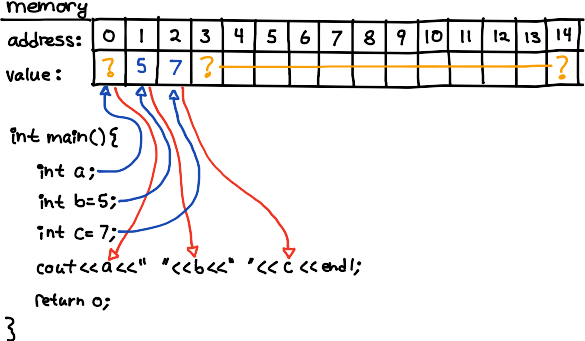
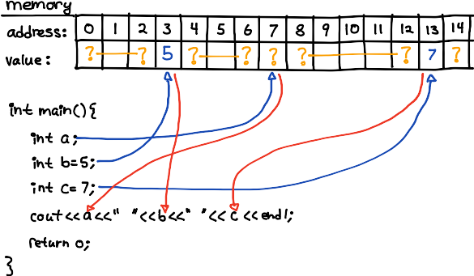
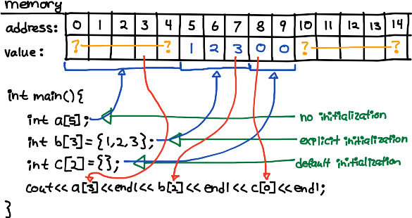
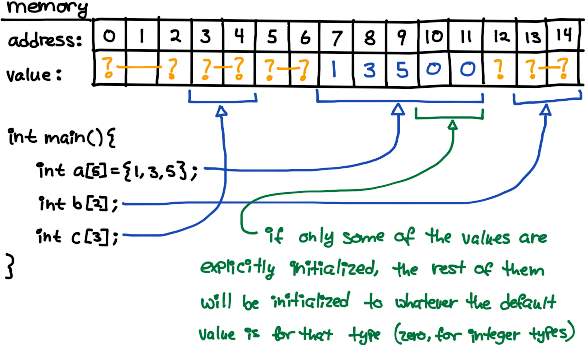

# Week 12

## Contents

- Review: Loops
- Introduction to Arrays
- Exercise
    - Part 1: Operations on a List of Integers
    - Part 2: Palindromes


## Review: Loops

Consider the following code:
```C++
#include <iostream>
using std::cout;
using std::endl;

int main() {
    int a = 5;
    int b = 7;

    // --- 1 ---

    if (a < b) {
        cout << a << endl;
    } else {
        cout << b << endl;
    }

    // --- 2 ---

    if (a < b)
        cout << a << endl;
    else
        cout << b << endl;

    return 0;
}
```

Note that both -1- and -2- are equivalent.  If there is only one statement in
the body of an if or else, the braces are not optional.

Now consider this:
```C++
#include <iostream>
using std::cout;
using std::endl;

int main() {
    int a = 5;
    int b = 7;

    // --- 1 ---

    if (a < b) {
        a += 10;
        cout << a << endl;
    } else {
        b += 10;
        cout << b << endl;
    }

    return 0;
}
```

Note the use of braces, since there are now two statements inside the body of
both the if and the else.  If we had omitted the braces, we would have:
```C++
#include <iostream>
using std::cout;
using std::endl;

int main() {
    int a = 5;
    int b = 7;

    // --- 2 ---

    if (a < b)
        a += 10;
        cout << a << endl;
    else
        b += 10;
        cout << b << endl;

    return 0;
}
```

Does the above code compile?

Note though that there's nothing requiring that an if always be paired with an
else, or that the body of an if or else contain any statements at all.  The
below code is perfectly valid:
```C++
#include <iostream>
using std::cout;
using std::endl;

int main() {
    int a = 5;
    int b = 101;

    if (a < b);
    a += 10;            // this is always executed
    cout << a << endl;  // this is always executed

    if (a < b){}
    a += 10;            // this is always executed
    cout << a << endl;  // this is always executed

    if (a < b)
        a += 10;        // this is only executed if `a < b` is true
    cout << a << endl;  // this is always executed

    if (a < b) {
        a += 10;        // this is only executed if `a < b` is true
    }
    cout << a << endl;  // this is always executed

    if (a < b) {
        a += 10;            // this is only executed if `a < b` is true
        cout << a << endl;  // this is only executed if `a < b` is true
    }

    return 0;
}
```

Note also that in C++ whitespace is (usually) not significant: the code below does the exact same thing 4 times.
```C++
#include <iostream>
using std::cout;
using std::endl;

int main() {
    int a = 5;
    int b = 101;

    if (a < b)
        a += 10;
    cout << a << endl;

    if (a < b)
        a += 10;
        cout << a << endl;

    if (a < b) a += 10; cout << a << endl;

    if (a < b) { a += 10; } cout << a << endl;

    return 0;
}
```


## Introduction to Arrays

Remember how variables are stored in memory?  Each variable is assigned a
location, which has an address.  When a variable is referenced (as in the cout
statement in the picture below), the value of the variable is looked up at the
corresponding address in memory, and then used in place of the variable.



Note that the variables don't have to be allocated in the order in which they
are declared (the compiler can do what it wants):



For completeness (even though you don't need to worry about it right now):
- The memory addresses your program uses will (on any common system) never
  actually start at 0, since the memory at address 0 is typically reserved by
  the operating system for its own use, and treated as an invalid memory
  location by user programs.  For the purposes of our picture though, it
  doesn't really matter (within certain limits) what addresses we use.
- Memory is (on all common systems) byte addressed, meaning that each byte in
  memory has its own address.  Most data types are larger than 1 byte though --
  you may remember that `int`s are 4 bytes (on current 64-bit Intel machines,
  like we're using) -- so memory won't typically have one value stored per
  address, as in the picture, it will instead have 1 `int` taking up 4 slots.
  We often draw memory with one `int` per address though, unless we're worried
  about what the actual bytes look like, because it's easier that way.

Now, think back to some program you wrote where you had to declare a bunch of
`int`s -- like in your tic-tac-toe program, where you needed 9 integers, 1 for
each cell in the game board.  You may have named them something like `cell_1`,
`cell_2`, ..., `cell_9`, or maybe `a`, `b`, ..., `i`, or something like that.
It was kind of annoying to have to name them all individually, right?  Arrays
make things a bit cleaner :)

You declare an array (possibly initializing it at the same time) in one of
three ways:



Notice:
- All the elements of each array are right next to each other in memory.
- Arrays are *zero indexed*: that is, the first element of the array `int
  a[5];` is `a[0]` and the last element (the fifth element) is `a[4]`.  We call
  the number inside the brackets the "index" or the "offset".  It's helpful to
  think of it as "the distance from the first element", where of course the
  first element is zero elements away from itself.

Note that, just as with variables, each array does not have to be allocated in
memory in the order in which it was declared (the compiler can do what it
wants); but all elements in each array do have to be right next to each other:



Finally, even though you won't formally cover it until CS 121, I think it's
important to have a general idea of how arrays relate to pointers.
- A *pointer* is a variable that contains the memory address of another
  variable.  Recall (it's important!) that variables are stored in memory, and
  each byte in memory has its own address.
- You get the memory address of a variable, by using the `&` prefix operator
  (why `&`?  I really don't know...  but that's what you use).
- You get the value stored at some memory location by using the `*` prefix
  operator.
- An array is really a pointer to the first element of the array, along with
  some type information that the compiler keeps track of to make our lives
  easier.

```C++
#include <iostream>
using std::cout;
using std::endl;

int main() {
    // declare an array, `a`, with 5 elements, all explicitly initialized
    int a[5] = {1,2,3,4,5};

    cout << "address of the array: " << a << endl;
    cout << "address of the array: " << &a[0] << endl;
    cout << endl;
    cout << "first element of the array: " << *a << endl;
    cout << "first element of the array: " << *(&a[0]) << endl;
    cout << "first element of the array: " << a[0] << endl;
    cout << endl;
    cout << "third element of the array: " << *(a+2) << endl;
    cout << "third element of the array: " << *(&a[0]+2) << endl;
    cout << "third element of the array: " << a[2] << endl;

    cout << endl;

    cout << "the contents of the array:" << endl;
    for (int i=0; i<5; i++)
        cout << a[i] << endl;
    cout << endl;

    return 0;
}
```

Finally, a WARNING: Because arrays are really just pointers to the first
element, *it is possible to ask for elements that don't exist.*  For example,
if we have `int a[2] = {1,2};` we could later say `cout << a[7] << endl;`.
- If the memory address we are trying to read from is outside the memory
  allocated to our program, the operating system will detect this, and kill our
  program (this is what's called a "segfault" or "segmentation fault": when a
  program tries to violate the way the operating system has segmented the
  memory, and read something belonging to another program).
- If the memory address we are trying to read from does happen to be allocated
  to our program, the computer will happily read whatever it finds there,
  pretending it's an integer (no matter what it actually is), and our program
  will run, but not do what we intended.  This would be an example of a *logic
  error*.  This type of problem is actually what's at the root of many security
  bugs and runtime errors in production programs.

These errors are a royal pain to track down, so whenever you're using arrays
you should **double and triple and quadruple check that you're not asking for
array elements that don't exist.**  Okay.  Thank you :)

So now that we've talked about what arrays are, what are they good for?  Turns
out, they're good for lots of things, many of which aren't really obvious when
you're starting out.  For instance, say you have a switch statement that looks like
```C++
    // return the English form of the remainder, after dividing `num` by 5
    switch (num % 5) {
        case 0: cout << "zero"; break;
        case 1: cout << "one"; break;
        case 2: cout << "two"; break;
        case 3: cout << "three"; break;
        case 4: cout << "four"; break;
    }
```
With arrays, you could write
```C++
    string words[] = {"zero", "one", "two", "three", "four"};
    cout << words[num%5];
```
Notice though that we must be very careful: this code will never ask for an
element of the array that doesn't exist, will it?  No?  So we're good.  This
sort of thing is called a "lookup table", because we're using the array like a
table, to look something up instead of computing it.

- Also notice that we didn't put any number in the brackets in the code above.
  This is not an error: if you are initializing the array at the same time
  you're declaring it, the compiler can figure out the dimension of the array
  (i.e. how many elements the array has), so you don't need to write it inside
  the brackets (unless you want to).

Arrays are also good for storing any list of things that you know the maximum
length of ahead of time, and which you want to keep in order.  If you're
thinking of them this way, arrays are good for anything you might use a list
for: you can look for things in the list, you can sort the list, you can
reverse the list, you can find the average of all the number in the list, ...
In fact, large parts of theoretical computer science deal with exactly how to
do these sorts of things (usually using arrays, because they're usually faster
than other types of lists), and with how long these types of things tend to
take.


## Exercise

### Part 1: Operations on a List of Integers

Replace the `TODO` comments with the appropriate code.  It may help to draw a
picture of the memory (like in the examples above) and then think more
specifically about what you're trying to do (I do this quite a bit actually,
when I'm working with arrays in ways that I'm not yet familiar with).

```C++
/**
 * TODO: your name
 * week 12
 * array exercise part 1
 */


#include <cstdlib>
// rand()
// srand()
// time()

#include <iostream>
using std::cout;
using std::endl;


int main() {
    // declare an array with 100 elements
    int a[100];

    // seed the random number generator
    srand(time(NULL));

    // initialize the array with 100 random values, each between 0 and 999,
    // inclusive
    for (int i=0; i<100; i++)
        a[i] = rand()%1000;

    // TODO:
    // - print out all the elements of array `a`, with spaces inbetween
    // - print the smallest element of array `a`
    // - print the largest element of array `a`
    // - print the sum of all the elements in array `a`
    // - print the average of all the elements in array `a`

    return 0;
}
```


### Part 2: Palindromes

Write a program that does the following:

0. Read in a single word from the user.
0. If the word is a palindrome (i.e. if the word is the same both forwards and
   backwards, like "racecar", and not like "fred"), print out "this word is a
   palindrome!".  If not, print out "this word is not a palindrome...".
   - This step is intentionally vague.  Some effort may be required to figure
     out how to do it.  *Please* do it yourself instead of looking it up.
     Unless you don't want to learn anything...

Hints:
- Recall that strings are very good for reading in single words.
- Especially since, if you have a variable `string word;`, you can use
  `word.length()` to determine how many characters it contains :)
- "mom", "dad", "bob", and "racecar" are all palindromes.  "fred", and most
  other words, are not.  You can search online for more to test with, if you
  like.

If you're super fast, you might want to find a dictionary file online, and see
if you can find a way to search through all the words, and have your program
print out those that are palindromes.  Or at least (since that would likely
take a long time) maybe think about how that might be accomplished :) .


## Continuing Challenges

- [Learn how to use Git](http://git-scm.com/documentation)

- Lean how to use Vim (type `vimtutor` into the terminal, and follow the
  instructions)

- [Learn Python](http://docs.python.org/3.3/tutorial/)

- Learn [one of the languages on codecademy] (http://www.codecademy.com)
    - Especially Python, Ruby, or JavaScript

- Write a [bash script](http://www.tldp.org/LDP/abs/html/) (or an [expect
  script](http://w2home.blogspot.com/2007/11/expect-tutorial.html) if you're
  feeling *super* ambitious) (or an [applescript
  script](http://macosxautomation.com/applescript/firsttutorial/index.html) if
  you like) to automate the testing of the code in this project for you.
    - There may be better tutorials for expect and applescript; I have a lot of
      experience with the page linked above for bash scripting though, and IMO
      it's really good.
    - Necessarily, this is a Linux / Mac / Cygwin (on Windows) only challenge.


-------------------------------------------------------------------------------

Copyright &copy; 2014 Ben Blazak <ic07@csu.fullerton.edu>  
Released under [The MIT License] (http://opensource.org/licenses/MIT)  
Project located at <https://github.com/benblazak/2014-spring-si-cpsc120>

